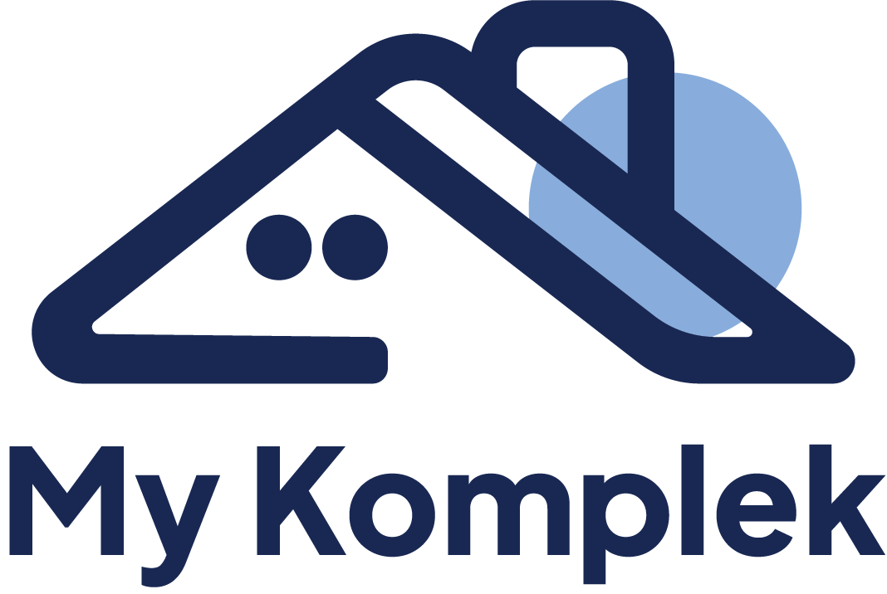
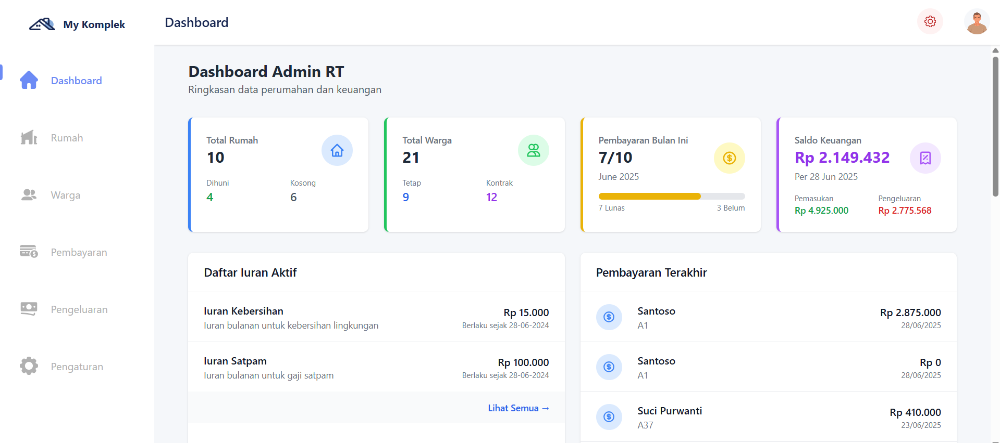
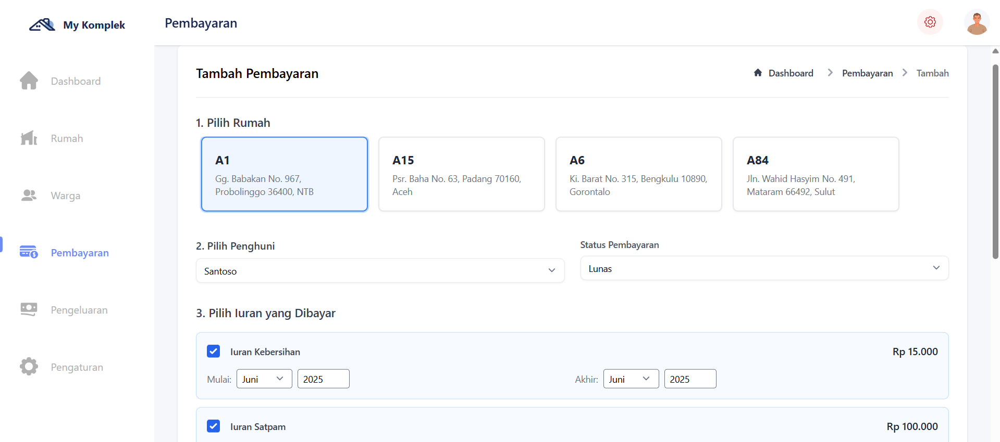
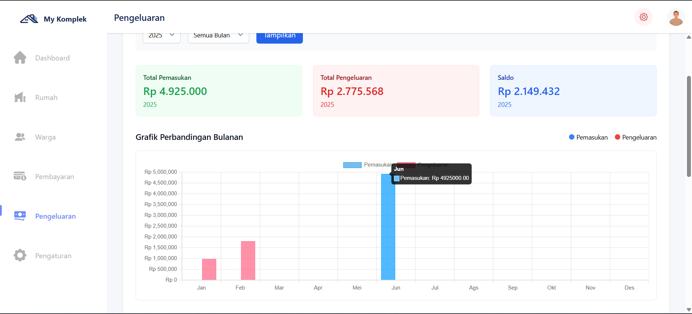
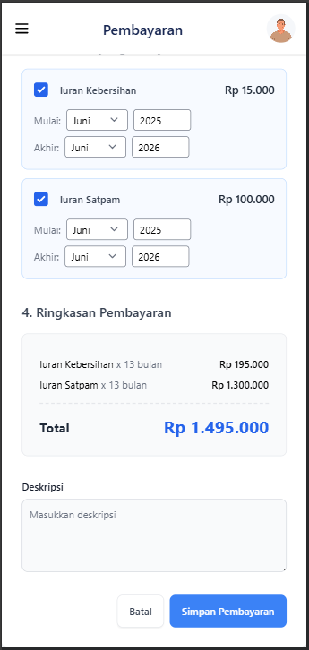

<p align="center">
  
</p>

## 📌 Tentang Proyek

Proyek ini adalah sistem manajemen RT berbasis web yang dibangun menggunakan Laravel 12. Sistem ini memungkinkan pengelolaan rumah, penghuni, pembayaran iuran, hingga laporan keuangan bulanan dengan UI yang modern menggunakan Tailwind, Flowbite, dan Preline.

<hr>

#### 🖼️ Screenshot Website

<details>
  <summary><strong>📌 Dashboard</strong></summary>
  <p align="center">
    
  </p>
</details>

<details>
  <summary><strong>📝 Payment</strong></summary>
  <p align="center">
    
  </p>
</details>

<details>
  <summary><strong>📈 Chart</strong></summary>
  <p align="center">
    
  </p>
</details>

<details>
  <summary><strong>📱 Tampilan Mobile</strong></summary>
  <p align="center">
    
  </p>
</details>
<hr>

### 🚀 Fitur Utama

<details>
  <summary>🏠 <strong>Dashboard</strong></summary>
  <ul>
    <li>Menampilkan ringkasan data penting seperti jumlah rumah, penghuni, total pemasukan, dan pengeluaran secara real-time.</li>
  </ul>
</details>

<details>
  <summary>🏡 <strong>Manajemen Rumah</strong></summary>
  <ul>
    <li>Kelola data rumah, status hunian (tetap / kontrak), dan histori kepemilikan atau penyewaan.</li>
  </ul>
</details>

<details>
  <summary>👨‍👩‍👧‍👦 <strong>Manajemen Penghuni / Warga</strong></summary>
  <ul>
    <li>Tambah, edit, dan kelola data penghuni lengkap dengan status domisili dan relasi keluarga.</li>
  </ul>
</details>

<details>
  <summary>💳 <strong>Manajemen Pembayaran</strong></summary>
  <ul>
    <li>Catat dan pantau pembayaran iuran warga seperti kebersihan dan keamanan, termasuk status lunas atau tunggakan.</li>
  </ul>
</details>

<details>
  <summary>💸 <strong>Manajemen Pengeluaran</strong></summary>
  <ul>
    <li>Dokumentasikan pengeluaran kas RT, lengkap dengan tanggal, deskripsi, dan nominal.</li>
  </ul>
</details>

<details>
  <summary>📊 <strong>Grafik Pengeluaran vs Pemasukan</strong></summary>
  <ul>
    <li>Visualisasi data keuangan bulanan dalam bentuk grafik batang atau garis untuk memudahkan analisis.</li>
  </ul>
</details>

<details>
  <summary>⚙️ <strong>Pengaturan</strong></summary>
  <ul>
    <li>Konfigurasi sistem dasar seperti pengguna/admin sistem,</li>
  </ul>
</details>

<hr>

## ⚙️ Tutorial

#### 🧾 Persyaratan

<h4> Pastikan sistem kamu telah terpasang: </h4>
<ul>
    <li>PHP >= 8.2</li>
    <li>Composer</li>
    <li>Node.js & NPM</li>
    <li>MySQL / MariaDB</li>
</il>

#### 1. 🚀 Clone Repository dari GitHub


```bash
git clone https://github.com/NasFahmi/MyKomplek
cd MyKomplek
```

####  2. ⚙️ Setting Enviroment 
eksekusi comand ini di gitbash/cmd <br>

```bash
cp .env.example .env
composer install
npm install
php artisan key:generate
```


#### 3. 📂 Setting Database
Buat Database bernama "mykomplek" <br>
copy code ini ke .env

```bash
DB_CONNECTION=mysql
DB_HOST=127.0.0.1
DB_PORT=3306
DB_DATABASE=mykomplek
DB_USERNAME=root #user default
DB_PASSWORD=
```

#### 5. 🛠️ Migrasi dan Seeder 
Jalankan perintah berikut untuk membuat tabel dan data awal: <br>

```bash
php artisan migrate:fresh --seed
```


#### 6. 🌐 Jalankan Server Laravel

```bash
composer run dev
```
jika menggunakan laravel versi 11 kebawah jalankan 2 terminal ini
terminal 1 run laravel:
```bash
php artisan serve
```
terminal 2 run run dev:
```bash
npm run dev
```

Aplikasi akan berjalan di:
```bash
http://127.0.0.1:8000
```

##  Lisensi
This project was developed by [Nasrul Fahmi](https://github.com/NasFahmi) and is released as open-source software under the following license:

**© 2025 Nasrul Fahmi. All rights reserved.**

Licensed under the terms of the [MIT License](LICENSE)
